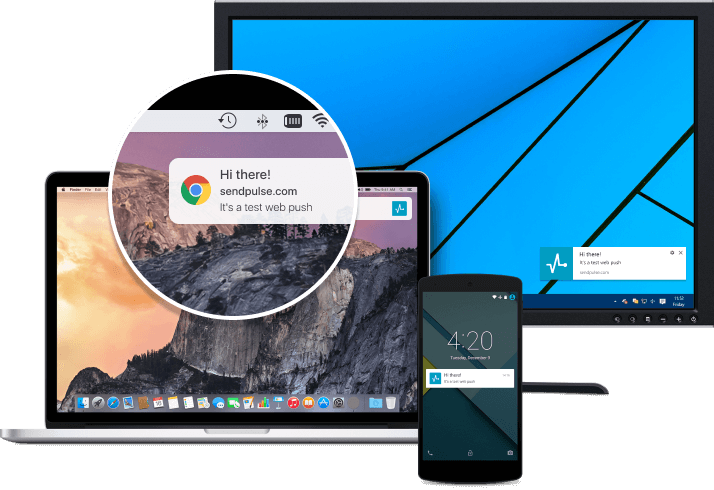
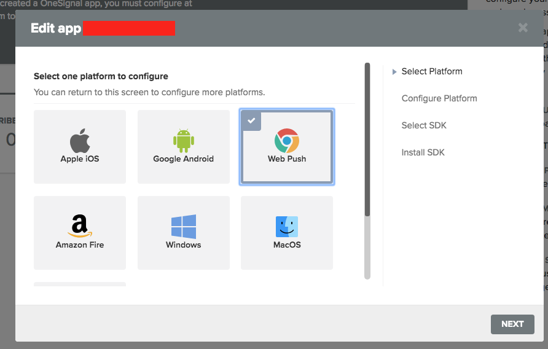
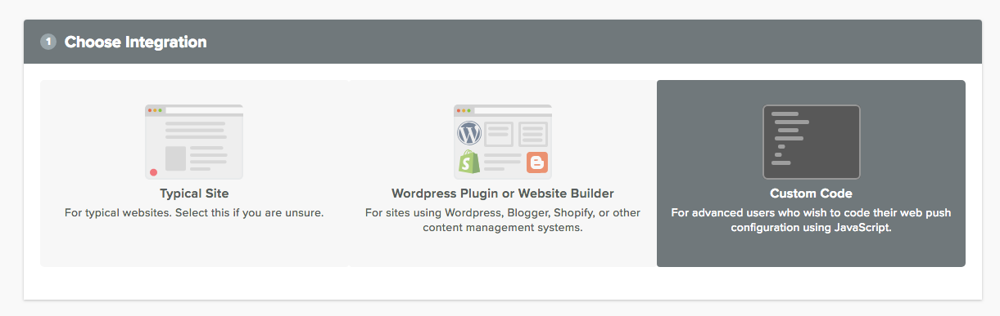

# Web Push Notifications Plugin

The **Web Push Notifications** Plugin is a plugin for [Grav CMS](http://github.com/getgrav/grav) based on [OneSignal](http://onesignal.com) service. Web push notifications are messages that come from a website. You get them on your desktop or device even when the website is not open in your browser. It is a new marketing channel to re engage your site visitors without knowing their email or other contact details. All major browsers support Web Push. Android devices may also receive Web Push notifications, in addition to notifications from apps.

## Some of OneSignal features
* **Supports Chrome** (Desktop & Android), **Safari** (Mac OS X), **Microsoft Edge** (Desktop & Android), **Opera** (Desktop & Android) and **Firefox** (Desktop & Android) on both HTTP and HTTPS sites.
* **Automatic Notifications** - Send notifications to followers every time you publish a new post. 
* **Targeting Segments** - Send notifications to specific visitors based on language, number of times they’ve visited your blog, or even set up your own user attributes that you can target. (currently only through OneSignal Web Panel)
* **Opt-In Customization** - Choose when and how to ask your visitors to opt-in to browser notifications. Customize the prompt they first see.
* **Real Time Analytics** - See your notifications being delivered in real time, and watch them as they convert into visitors.
* **A/B Testing** - Try out different messages to a smaller set of your visitors to figure out which messages are more effective and then send the more effective message to the rest of your visitors!
* **Scheduled Notifications** - Schedule notifications to be delivered in the future, based on a user’s time zone, or even based on the same time of day they last visited your website. (currently only through OneSignal Web Panel)
**All completely free. No fees or limitations.**

## Why should you use Web Push Notifications – what are the advantages?
* WEB-SCALE REACH - Chrome, Firefox, and Safari combined have a market share of 75%+, meaning the reach of web push notifications is nearly a billion users.
* NO NEED FOR ANDROID APP - Web push notifications work exactly like the native mobile push on Android, so you don’t have to create a mobile app to send native push notifications.
* ACCESS TO USERS WHO ARE NOT ON YOUR WEBSITE - Using web push notifications, you can reach out to those users who are not on your website.
* RE-ENGAGEMENT WITHOUT CONTACT DETAILS - Web push notifications don’t need a user’s email or other contact details.
* GREATER OPT-IN RATE - It's easier for users to sign up for Web Push than email, which results in higher opt-ins than email.
* LOWER UNSUBSCRIBE / OPT-OUT RATES - Studies have shown that less than 10% of the subscribers who opted for notifications from a site unsubscribed in a year.
* BETTER DELIVERY - Emails sometimes fail to deliver or get marked as spam, while notifications have more prompt and assured delivery.
* HIGHER CONVERSION RATES - Studies have shown that web push notifications have 30 times higher conversion when compared with email.
* STAY TOP OF MIND - Sending notifications even when the users are not on your website helps you stay top of mind with users, especially if they've previously engaged (such as adding content to a cart on your site).

## Installation

Installing the Web Push Notifications plugin is done in few steps. 

### Register [OneSignal](http://onesignal.com) account.

First of all you will have to register account at [OneSignal](http://onesignal.com). After registration, please add new app by clicking "Add App" button in your dashboard. Then select "Web Push"

As an integration please select "Custom Code" (important):

That's it. Configure all needed fields (url, your icon, safari and then hit Save).

### Download OneSignal SDK files

This VERY IMPORTANT step. You have to downlaod [OneSignal SDK Files](https://github.com/OneSignal/OneSignal-Website-SDK/releases/download/https-integration-files/OneSignal-Web-SDK-HTTPS-Integration-Files.zip) and you have to place them on your domain root. So for example. Your Grav installation is placed at **https://yourdomain.com**. You have to unzip whole directory and upload all files from this zip to your domain. So they are accessible like:

    https://yourdomain.com/OneSignalSDKWorker.js
    https://yourdomain.com/OneSignalSDKUpdaterWorker.js

Please don't submit any bugs if files above does not exist in your domain. The same apply for subdomain https://yourdomain.com. Then files must be uploaded to subdomain root:

    https://subdomain.yourdomain.com/OneSignalSDKWorker.js
    https://subdomain.yourdomain.com/OneSignalSDKUpdaterWorker.js

What about subdirectories ? The same rule apply. Service worker files must be on your domain root. So if you have Grav installation like **https://yourdomain.com/grav**, then files has to be on your domain root: 

    https://yourdomain.com/OneSignalSDKWorker.js
    https://yourdomain.com/OneSignalSDKUpdaterWorker.js

Don't ask me why is that. This is just how service workers.. works :D. If you're familiar with PWA, then that shouldn't be a news for you :)

After that just continue with regular Grav install. 

### GPM Installation (Preferred)

The simplest way to install this plugin is via the [Grav Package Manager (GPM)](http://learn.getgrav.org/advanced/grav-gpm) through your system's terminal (also called the command line).  From the root of your Grav install type:

    bin/gpm install webpush

This will install the Web Push Notifications plugin into your `/user/plugins` directory within Grav. Its files can be found under `/your/site/grav/user/plugins/webpush`.

### Manual Installation

To install this plugin, just download the zip version of this repository and unzip it under `/your/site/grav/user/plugins`. Then, rename the folder to `webpush`. You can find these files on [GitHub](https://github.com/devlom/grav-plugin-webpush) or via [GetGrav.org](http://getgrav.org/downloads/plugins#extras).

You should now have all the plugin files under

    /your/site/grav/user/plugins/webpush
	
> NOTE: This plugin is a modular component for Grav which requires [Grav](http://github.com/getgrav/grav) and the [Error](https://github.com/getgrav/grav-plugin-error) and [Problems](https://github.com/getgrav/grav-plugin-problems) to operate.

### Admin Plugin

If you use the admin plugin, you can install directly through the admin plugin by browsing the `Plugins` tab and clicking on the `Add` button.

## Configuration
Before configuring this plugin, you should copy the `user/plugins/webpush/webpush.yaml` to `user/config/plugins/webpush.yaml` and only edit that copy. Plugin has around 50 configuration options. Feel free to experiment with those. 

Note that if you use the admin plugin, a file with your configuration, and named webpush.yaml will be saved in the `user/config/plugins/` folder once the configuration is saved in the admin.

## Usage
You can of course send Notifications using onesignal.com WebPanel but we have better idea. Just use our awesome Web Push tab. Tab is added to every page. Just take a look: 

All you have to do is polish preloaded data. Check "Send Notification" and hit "Save". Isn't that easy ? How AWESOME is that :) ? Good luck :)

Credits
========================

OneSignal Wordpress APP
https://wordpress.org/plugins/onesignal-free-web-push-notifications/

## To Do

- [ ] Add Multilang Support

License
========================

The MIT License (MIT)

Permission is hereby granted, free of charge, to any person obtaining a copy
of this software and associated documentation files (the "Software"), to deal
in the Software without restriction, including without limitation the rights
to use, copy, modify, merge, publish, distribute, sublicense, and/or sell
copies of the Software, and to permit persons to whom the Software is
furnished to do so, subject to the following conditions:

The above copyright notice and this permission notice shall be included in
all copies or substantial portions of the Software.

THE SOFTWARE IS PROVIDED "AS IS", WITHOUT WARRANTY OF ANY KIND, EXPRESS OR
IMPLIED, INCLUDING BUT NOT LIMITED TO THE WARRANTIES OF MERCHANTABILITY,
FITNESS FOR A PARTICULAR PURPOSE AND NONINFRINGEMENT. IN NO EVENT SHALL THE
AUTHORS OR COPYRIGHT HOLDERS BE LIABLE FOR ANY CLAIM, DAMAGES OR OTHER
LIABILITY, WHETHER IN AN ACTION OF CONTRACT, TORT OR OTHERWISE, ARISING FROM,
OUT OF OR IN CONNECTION WITH THE SOFTWARE OR THE USE OR OTHER DEALINGS IN
THE SOFTWARE.

